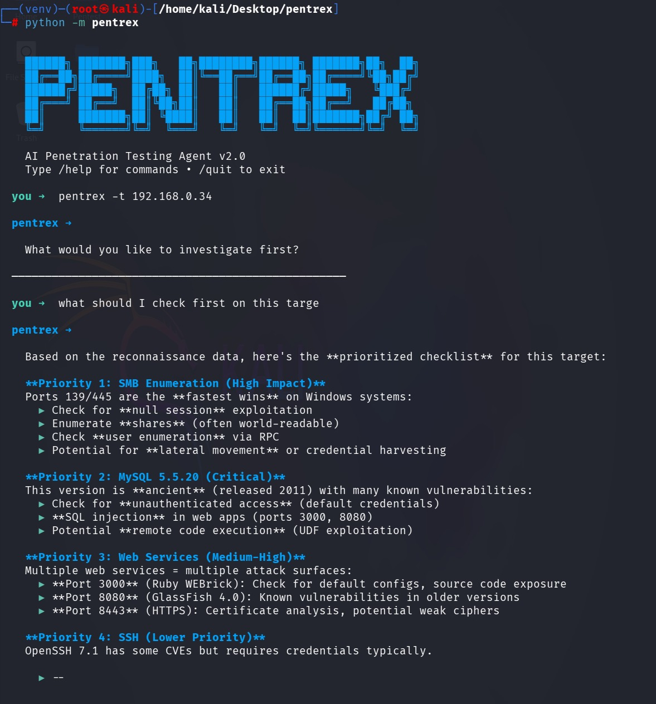

# Pentrex
<p align="center">
  
</p>

AI-powered penetration testing agent with multi-agent crew mode. Autonomous reconnaissance, scanning, vulnerability analysis, and exploitation through coordinated AI workers.


## Crew Mode

Pentrex can deploy a team of specialized AI agents that work together:

```
you ➜  /target 192.168.1.1
you ➜  /crew full penetration test

  Crew mode: full penetration test
  Orchestrator + Workers • Press Ctrl+C to stop

  [Orchestrator] Planning attack phases...
  [Crew] Delegating to ReconWorker...
  [ReconWorker] Running DNS enumeration...
  [ReconWorker:tool] nmap_scan
  [ReconWorker:tool] save_note
  [Crew] Delegating to ScanWorker...
  [ScanWorker] Full port scan with service detection...
  [ScanWorker:tool] nmap_scan
  [Crew] Delegating to VulnWorker...
  [VulnWorker] Analyzing findings against known CVEs...
  [Orchestrator] Found 3 open ports, 2 vulnerabilities. Delegating exploit verification...
```

| Worker | Role |
|--------|------|
| **ReconWorker** | DNS, subdomains, OSINT, fingerprinting |
| **ScanWorker** | Port scanning, service detection, OS fingerprinting |
| **VulnWorker** | CVE analysis, misconfiguration checks, severity rating |
| **ExploitWorker** | PoC verification, safe exploitation attempts |

The **Orchestrator** coordinates all workers, analyzes results between phases, and decides the next strategic move.

## All Modes

| Mode | Command | Description |
|------|---------|-------------|
| Assist | (default) | Chat with the agent. You control the flow. |
| Agent | `/agent <task>` | Autonomous single-task execution. |
| Crew | `/crew <task>` | Multi-agent orchestrator + specialized workers. |
| Learn | `/learn` | Quiz, explanations, tool guides. |

## Install

```bash
git clone https://github.com/sideffectt/pentrex.git
cd pentrex

# Setup
python -m venv venv
source venv/bin/activate        # Linux/macOS
# .\venv\Scripts\Activate.ps1  # Windows

pip install -e ".[all]"
```

## Configure

```bash
cp .env.example .env
# Edit .env with your API key
```

```env
ANTHROPIC_API_KEY=sk-ant-...
PENTREX_MODEL=claude-haiku-4-5-20251001
```

Any LiteLLM-supported provider works (OpenAI, Ollama, etc).

## Run

```bash
pentrex                         # Launch TUI
pentrex -t 192.168.1.1          # Launch with target
pentrex run --playbook web_recon -t example.com  # Run playbook
```

## TUI Commands

```
/agent <task>    Autonomous agent on a task
/crew <task>     Multi-agent crew mode
/target <host>   Set target
/tools           List available tools
/notes           Show saved findings
/report          Generate report
/learn           Enter learning mode
/playbook <name> Run attack playbook
/mcp list        List MCP servers
/clear           Clear chat
/quit            Exit
```

## Playbooks


```bash
pentrex run --playbook web_recon -t example.com
pentrex run --playbook network_scan -t 192.168.1.0/24
```

## Tools


**Built-in:** terminal, nmap, notes, web_search

**MCP:** Configure `mcp_servers.json` for external tools:

```json
{
  "mcpServers": {
    "nmap": {
      "command": "npx",
      "args": ["-y", "gc-nmap-mcp"]
    }
  }
}
```

## Project Structure

```
pentrex/
├── pentrex/
│   ├── agents/          # Agent implementations
│   ├── tools/           # Built-in tools (terminal, nmap, notes, quiz)
│   ├── llm/             # LLM provider wrapper
│   ├── mcp/             # MCP client
│   ├── playbooks/       # Attack playbooks
│   ├── knowledge/       # RAG + learning content
│   ├── runtime/         # Execution environment
│   ├── interface/       # TUI
│   └── config/          # Settings
├── loot/                # Findings output
├── scripts/             # Setup scripts
└── tests/
```

## Legal

Only use against systems you have explicit authorization to test. Unauthorized access is illegal.

## License

MIT
